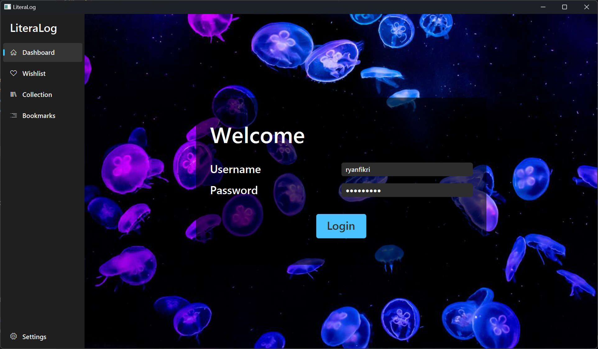
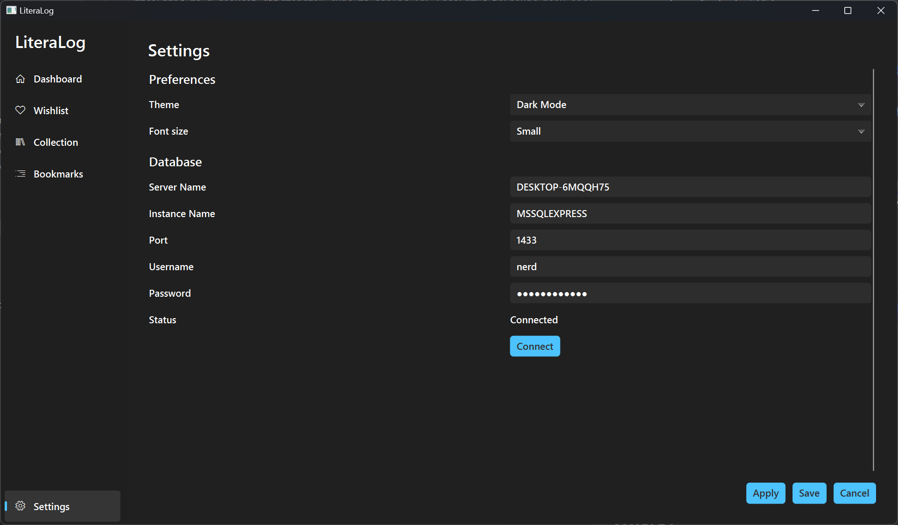
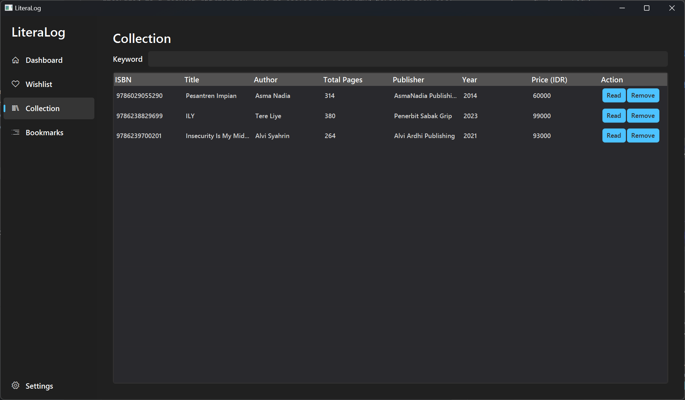

# LiteraLog

## What?
LiteraLog is a desktop application that is useful for recording personal book collections, recording reading progress, and recording book wishlist. 
### Screenshots

## Who?
Me, obviously.

## When?
During the 3rd semester break.

## Where?
In my house, duh.

## Why?
This project is my attempts to learning the following material
1. Object-Oriented programming.
    1. Encapsulation.
    2. Inheritance.
    3. Polymorphism
    4. etc.
2. JDBC (Java Database Connectivity) API.
3. JavaFX Framework.

## How?
Wait until this text has been edited again.